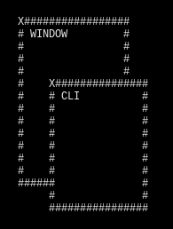

<!-- https://codinhood.com/nano/git/center-images-text-github-readme-->
<h1 align="center" style="font-size:72px">Window CLI</h1>

!//////////////////////////////////////////////////////! 
!     WARNING: Under Construction     ! 
!\\\\\\\\\\\\\\\\\\\\\\\\\\\\\\\\\\\\\\\\\\\\\\\\\\\\\\!

        

This is a rust made small multi window crate, 
currently not implemented,
Terminal UI.

# Keys

| ACTION | KEY |
|--------|-----|
| move window up | w |
| move window down | r |
| move window left| a |
| move window right | s |
| increase window width | - |
| decrease window width | = |
| increase window length | _ |
| decrease window length | + |
| insert in selected window | I |
| change focus | tab |
| create new window | enter/return |
| quit | q |

<table>
    <thead>
        <tr>
            <th align="left">Column1</th>
            <th align="center">Column1</th>
        </tr>
    </thead>
    <tbody>
        <tr>
            <td align="left">Column1</td>
            <td align="center">Column1</td>
        </tr>
    </tbody>
</table>

